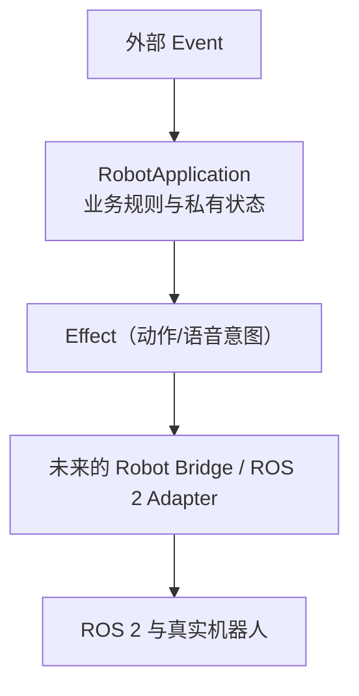

# 架构说明

## 模块和依赖方向

`robot_application/models.py` 只定义题目规定的不可变 `Event` 和 `Effect`。`robot_application/application.py` 只包含接待业务规则。`tests/` 通过公共 API 验证业务行为。当前项目没有 Bridge、ROS 2、相机或硬件 SDK 依赖。

## 状态归属和规则

每个 `RobotApplication` 实例独占一个私有 `_ReceptionState`：`present`、`greeted`、`conversation_active`、`meeting_active`、`left_at` 和 `departure_sent`。没有全局可变状态。

- `PERSON_ENTERED`：空闲的新接待周期产生 `wave_hand` 和“欢迎光临”；持续在场或短暂离开返回不会重复迎宾。
- `PERSON_LEFT`：仅在人员在场时记录 `left_at`，不立即送客。
- `TICK`：只有连续离开时间达到配置的超时值才处理送客，且同一次离场只处理一次。
- 对话或会议活跃时，迎宾和送客不产生 Effect；被抑制的超时被标记为已处理，因此结束后不会补发。

题目未规定多人的并发策略，所以实现建模为一个接待区域，而非擅自引入按 `person_id` 的多访客状态机；`person_id` 仍由规定的 `Event` 接口保留。

## 快照安全

内部状态是私有、冻结的 dataclass。`snapshot()` 构建并返回新的普通字典，而不是暴露内部对象；修改返回字典无法改动应用状态。测试对此进行了验证。

## 未来扩展

未来的 Robot Bridge 可消费 `Effect`，把 `ROBOT_ACTION` 映射到 ROS 2 Action Client、把 `SPEECH` 映射到语音服务，而不改变业务层。VIP 判断和 RAG 可在 Event 进入应用前的策略/上下文层产生附加信息；导航可由 Bridge 消费明确的导航 Effect。这样新增能力不会把 SDK 调用、对话检索和接待规则塞进一个大类。

当前取舍是刻意保持单区域、单接待周期和同步纯函数式输出，以匹配题目并便于无 ROS 环境测试。
